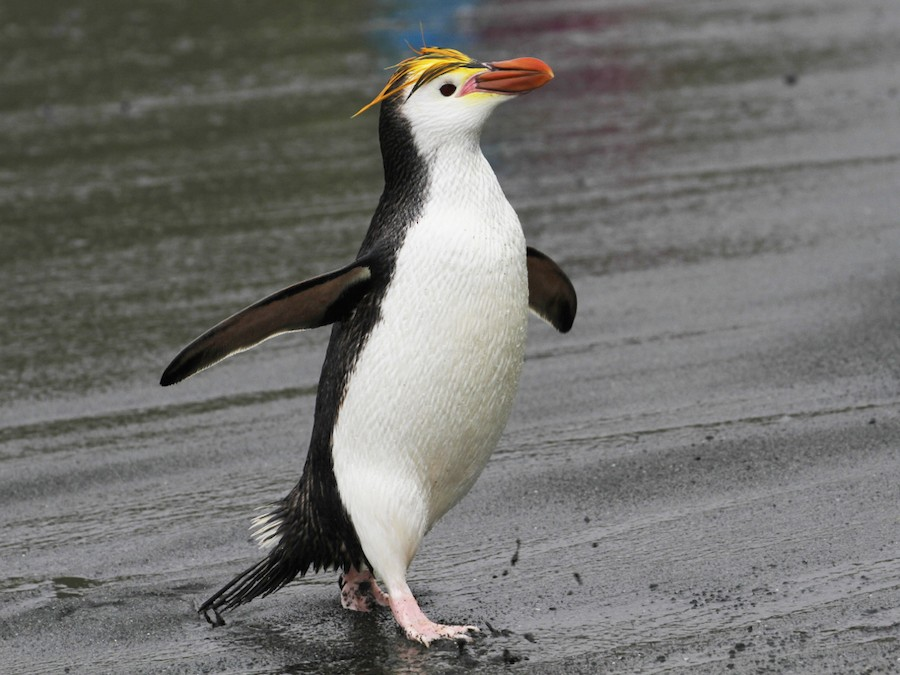

<link href="stylesheet.css" rel="stylesheet"></link>

# cyberdux_duckguin

***An aquatic avian menagerie***

## Introduction

It is our aim to create conflict with this project.

### Royal Penguin *(Gian)*

According to Wikipedia, *Eudyptes schlegeli* is found only on the sub-Antarctic Macquarie and adjacent islands.

It is very similar in appearance to the macaroni penguin, with which it occationally interbreeds, but is distinguised from that species by its white face.

Royals genereally lay two eggs, but typically, only incubate the second. Both parents share in this responsibility, rotating in 12-day shifts.

The royal penguin is classified in the IUCN Red List of Threatened Species as 'Least Concern' and its numbers are slowly increasing in the wild.

### Rockhopper *(Abhi, Elizna)*

### African Penguin 🐧 (Anel)

It might seem basic, but overlooking basics can have some detrimental effects. In this case, the African Penguin (affectionately known as the Cape Penguin) is currently critically endangered<a href="https://en.m.wikipedia.org/wiki/African_penguin">1</a>.

In my research on the topic, I learned two things:

1. They are the only penguins that (naturally) occur in "The Old World"<a href="https://en.m.wikipedia.org/wiki/African_penguin">1</a>.
2. "The Old World" is a term applied to Asia, Europe and Africa, to note the known world before the discovery of the Americas and Australia<a href="https://en.m.wikipedia.org/wiki/Old_World">2</a>.

### Add your penguin *(and your name)*
